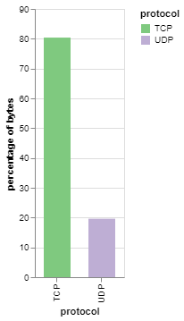

## Bokondini Data Analysis

Over the summer of 2019, I worked in the ICTD Lab at the University of Washington analyzing data coming back from a remote cellular network in Bokondini, Indonesia that our lab deployed. These are some of the results I found. I used Jupyter Notebook, Pandas, and Altair to create these graphs.

### HTTPS/HTTP Traffic (Percentages)

I found that the majority of traffic was to and from HTTPS sites.

### TCP/UDP Traffic (Percentages)

I found that the majority of traffic was TCP traffic.

### Traffic per Hour

<object width="100%" height="400" type="text/html" data="hourly_timeline_chart.html"></object>

Most days, the usage pattern is pretty similar, except for days where there are outages and there's little to none usage. Sometimes, there are spikes of lots of usage, in which I have not yet investigated for a cause.

### Average Day's Traffic

The average pattern seems to be less usage in the morning, when the network turns on at 4AM, a peak around noon, and then a peak at night before the network shuts off at 11PM. This is most likely because people are working during the day and not using the Internet, and then they get home and are able to.

### User's Average Day Traffic

### User to Local, User to User, and User to Remote Traffic (Percentages)

Most traffic goes to a remote area, some goes to the router (for DNS and other routing protocols), and very rarely, users are communicating with other users. The port number for those user-to-user communications is 137, which is a NetBios port. This led me to speculate that users are projecting onto other devices on the network, such as projecting their phone display onto a computer, making it easier to navigate.

### Traffic per Day

<object width="100%" height="400" type="text/html" data="graphs/daily_timeline_chart.html"></object>

The average traffic per day is 4.335387633386666 GB.

### Traffic to/from Each Site

Facebook and Google services were accessed a lot in Bokondini, followed by various different ad sites that I grouped together in a group called 'ads'. 

### Traffic to/from Each Site (Percentages, Categorized)

### Accesses to Each Site

When it comes to accesses, I used the flow data to count how many times there was a continuous flow between a site and a user. It turned out that AMPProject, one of Google's mobile optimization sites for Android, had many accesses to it, probably because many of the big sites accessed through cellular devices required that type of optimization. I wasn't completely sure what markets-unlimited.com was; when I looked it up, it looked like a real estate site, which didn't make sense to me. Additionally, ads were quite prevalent yet again, probably because each site needs to make its own money.

### Traffic per Port Type

## Time on each Site

## Timeline of Top Sites

<object width="100%" height="400" type="text/html" data="graphs/top_sites_chart.html"></object>

## Timeline of Top Categories of Sites

<object width="100%" height="400" type="text/html" data="graphs/categorized_timeline_chart.html"></object>

## Timeline of Android-related Sites

<object width="100%" height="400" type="text/html" data="graphs/android_categorized_timeline_chart.html"></object>
