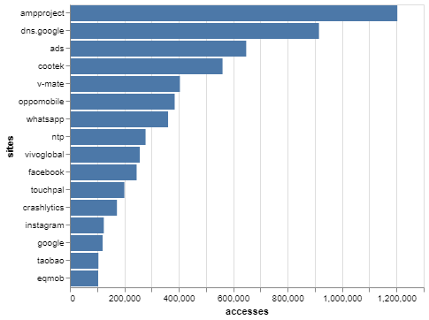

## Bokondini Data Analysis

### User Data:

[User Data Charts](users.md)

### Case Studies:

[markets-unlimited.com](markets-unlimited_case_study.md)

### HTTPS/HTTP Traffic (Percentages)

I found that the majority of traffic was to and from HTTPS sites.

### TCP/UDP Traffic (Percentages)

I found that the majority of traffic was TCP traffic.

### Traffic per Hour

<object width="100%" height="400" type="text/html" data="hourly_timeline_chart.html"></object>

Most days, the usage pattern is pretty similar, except for days where there are outages and there's little to none usage. Sometimes, there are spikes of lots of usage, in which I have not yet investigated for a cause.

### Average Day's Traffic

The average pattern seems to be less usage in the morning, when the network turns on at 4AM, a peak around noon, and then a peak at night before the network shuts off at 11PM. This is most likely because people are working during the day and not using the Internet, and then they get home and are able to.

### User's Average Day Traffic

The average day's traffic, but divided by the number of users in the community.

### User to Local, User to User, and User to Remote Traffic (Percentages)

Most traffic goes to a remote area, some goes to the router (for DNS and other routing protocols), and very rarely, users are communicating with other users. The port number for those user-to-user communications is 137, which is a NetBios port. This led me to speculate that users are projecting onto other devices on the network, such as projecting their phone display onto a computer, making it easier to navigate.

### Traffic per Day

<object width="100%" height="400" type="text/html" data="graphs/daily_timeline_chart.html"></object>

The average traffic per day is 4.335387633386666 GB.

### Traffic to/from Each Site

Facebook and Google services were accessed a lot in Bokondini, followed by various different ad sites that I grouped together in a group called 'ads'. 

### Traffic to/from Each Site (Percentages, Categorized)

Re-graphed above traffic data to make sense to the viewer as percentages.

### Accesses to Each Site

When it comes to accesses, I used the flow data to count how many times there was a continuous flow between a site and a user. It turned out that AMPProject, one of Google's mobile optimization sites for Android, had many accesses to it, probably because many of the big sites accessed through cellular devices required that type of optimization. I wasn't completely sure what markets-unlimited.com was; when I looked it up, it looked like a real estate site, which didn't make sense to me. Additionally, ads were quite prevalent yet again, probably because each site needs to make its own money.

### Traffic per Port Type

Most traffic was HTTPS, but there was some QUIC traffic and some HTTP traffic. Since many devices on the network are Android phones, the prevalence of QUIC traffic makes sense, since Android phones use a client-side implementation of QUIC, and some Google services that support QUIC also use it, when accessed.

## Time on each Site

We can infer that either lots of Google and Facebook services are being used (which makes more sense for Google because of Android phones than Facebook), or that Google and Facebook, in taking their data of the users, end up having lots of site accesses and thus longer flow times on their sites.

## Timeline of Top Sites

<object width="100%" height="400" type="text/html" data="graphs/top_sites_chart.html"></object>

Traffic from each of the top sites (AMPProject, Facebook, Google, Instagram, Whatsapp, and XNXX's CDN) in a timeline, condensed to traffic per hour.

Since AMPProject is a CDN-like service to help webpages load faster on mobile, much of the traffic is actually coming from other websites. However, we are not able to distinguish which websites exactly these come from, since all the traffic still goes through AMP, so it is all categorized under AMPProject. But something to keep in mind when looking at this data is that AMP itself is not a website, but a CDN-like service, so we have actually shown how much traffic is going through AMP every hour.

Much of the Facebook and Google traffic is difficult to differentiate between the different Facebook and Google services, which is why they're grouped together. We do not know how much is ads, chatting, storage, posting, etc. We only know the origin of the traffic. Additionally, since many of the phones on the network are Android phones, and a lot of Android traffic also goes back to Google, it makes sense that there would be lots of Google traffic.

We can safely assume from this data that Whatsapp is the main means of communication between the members of the Bokondini community, which is why there's a lot of traffic to and from it. We might also be able to assume that the community is utilizing the calling function of Whatsapp as well as sharing photos and videos, because for it to be on the same level as Instagram, Google and Facebook, there must be more than just textual traffic.

Since Instagram has many photos and videos, it makes sense that a lot of traffic would be coming from and going to Instagram.

Perhaps the most unexpected was a lot of traffic from XNXX's CDN. I wasn't too surprised to find traffic from adult videos, but I certainly didn't expect a single adult videos site to be in the top sites category. Additionally, although there isn't always someone active on the website, some of the spikes of activity turn out to be quite a lot more than the other activity in that hour. Specifically, from 8-9 PM on April 23rd, there was about 370 MB of traffic from XNXX.com, which is 10 times more traffic than Whatsapp, the service with the second most amount of traffic, during that hour. 

## Timeline of Top Categories of Sites

<object width="100%" height="400" type="text/html" data="graphs/categorized_timeline_chart.html"></object>

For the most part, much of the traffic throughout the day consist of ads, Facebook, and Google traffic. We can infer that many of the websites visited have ads on them, and Facebook and Google services are probably being used pretty consistently. Additionally, since many of the users in the community have Android phones, Google may be communicating with their phones even when they're not explicitly using a Google service. Many of these phones probably also have Facebook installed on them, and have active Facebook users, which is where much of the Facebook traffic comes from. Facebook may also be doing a similar thing to Google - communicating with the user's device even when the user isn't using the Facebook app. 

However, I was surprised at the steady accessing of news, CDNs, and other, less used site categories throughout the time period. It shows that the users have been making the most of their access to the Internet, especially if they are checking their devices at least once an hour.

## Timeline of Android-related Sites

<object width="100%" height="400" type="text/html" data="graphs/android_categorized_timeline_chart.html"></object>

There are many different Android phones from various Asian companies being used in the communities, and we can see this reflected in the various sites being accessed from these phones. We see companies such as ColorOS, Meizu, Samsung, Vivo, and Xiaomi, all of which are Asian Android phone companies that we can assume the users own phones from. Additionally, since some of these companies have their own app stores (notably, Vivo's app store is a popular one in Asia) and a few other non-Google app stores (such as 9apps) are accessed, we can assume that those app stores are being used a fair amount, especially with the spikes we see from 9apps and Vivo in the timeline.

I also included AMPProject under Android-related sites, but they are mostly a mobile-related site, rather than purely Android.

## Traffic per User as Distribution over All Users
### Hourly

<object width="100%" height="400" type="text/html" data="graphs/users/user_distr_traffic_hourly_violin.html"></object>

<object width="100%" height="400" type="text/html" data="graphs/users/user_distr_traffic_hourly_boxplot.html"></object>

### Daily

<object width="100%" height="400" type="text/html" data="graphs/users/user_distr_traffic_daily_violin.html"></object>

<object width="100%" height="400" type="text/html" data="graphs/users/user_distr_traffic_daily_boxplot.html"></object>

## Flow Lengths per Site Category

<object width="100%" height="400" type="text/html" data="graphs/users/category_count_distr_ridgeline.html"></object>

Due to efficiency concerns, in the original data each flow was sectioned off into 20 minute chunks. Once cleaned, any two flows with the same 5-tuples and one with the same ending time as the other's starting time were combined. As it turns out, there were not very many of these flows that lasted longer than 40 minutes total. Although they are still clumped into chunks and we do not know how long exactly each visit to each site by each user was, we have a rough estimate that most were between 0 and 20 minutes, and a few were between 20 and 40 minutes, but none were above 40 minutes.
